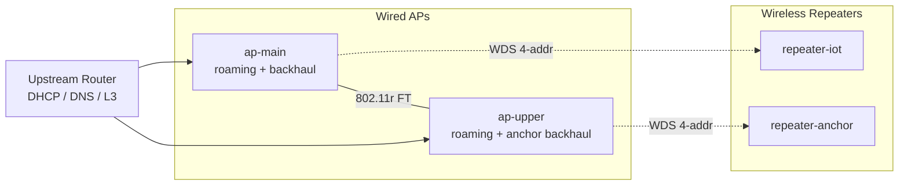

# OpenWrt-Only Home Network

[](https://github.com/fabianwimberger/openwrt-only-home-network/actions)
[](https://opensource.org/licenses/MIT)

A buildable, profile-driven blueprint for a whole-home WiFi network on OpenWrt — no vendor cloud, no proprietary mesh. Wired access points host the main roaming SSID with 802.11r FT-PSK; wireless repeaters extend coverage over a hidden WDS (4-address) backhaul.

## Background

Off-the-shelf "mesh" systems work, but they lock you into a vendor cloud and hide the knobs you actually want. OpenWrt has all the building blocks — `wpad`, 802.11r FT, 4-address WDS, `usteer` — but stitching them into something that roams cleanly *and* survives a marginal-signal repeater takes some thought. This repo is that stitched-together design, expressed as ImageBuilder profiles you can flash.

## Architecture



- **Wired APs** sit on the LAN, join `br-lan`, and broadcast the main roaming SSID with 802.11r fast-transition. They also host a hidden WDS access point on a dedicated backhaul SSID. `usteer` runs here for assoc-time client steering.
- **Wireless repeaters** join the backhaul as 4-address STAs, becoming L2-transparent extensions of `br-lan`. They can optionally advertise their own site-specific SSIDs (no FT, no `usteer`) for short-range / IoT clients that don't need to roam.

## Features

- **WDS / 4-address backhaul** — fully L2-transparent, no `batman-adv`, no `relayd`
- **802.11r FT-PSK** — fast transition between APs that share the mobility domain
- **`usteer`** — assoc-time client steering on the roaming SSID only
- **Multi-SSID** — separate IoT SSID without FT (some IoT chips mishandle it)
- **Anchor backhaul** — a marginal-signal repeater can pin to a different AP via a distinct backhaul SSID
- **Profile-driven** — one `.conf` per node, baked into firmware via UCI defaults
- **Parallel build+deploy** — `upgrade-all.sh` rolls every node concurrently
- **No firewall, no DHCP, no PPP** — APs are dumb bridges; the upstream router does L3

## Repository layout

| Path | Purpose |
|------|---------|
| [`wired-ap/`](wired-ap/) | Wired access points — main roaming SSID + WDS backhaul + `usteer` |
| [`wireless-repeater/`](wireless-repeater/) | Wireless repeaters — 4-addr STA backhaul + optional local SSID |

Each tier is a self-contained ImageBuilder project: `Dockerfile`, `build.sh`, `deploy.sh`, `upgrade-all.sh`, plus `profiles/` and `templates/`. The two tiers don't share scripts — keeping them independent makes each easier to read and lint.

## Quick Start

```bash
# 1. Pick a tier and copy the example profiles
cd wired-ap
cp profiles/common.conf.example profiles/common.conf
cp profiles/ap-main.conf.example profiles/ap-main.conf

# 2. Edit profiles/*.conf with your SSIDs, keys, IPs, country code

# 3. Build firmware for one node
./build.sh ap-main

# 4. Flash via the OpenWrt web UI, or — if the device already runs
#    OpenWrt with the same root password as in common.conf — deploy:
./deploy.sh ap-main
```

For a full-house roll:

```bash
./upgrade-all.sh                 # builds + deploys every profile in parallel
./upgrade-all.sh ap-main         # or restrict to specific profile(s)
```

## Security warning

> **⚠️ IMPORTANT:** Profile values — root password, AP keys, backhaul key, optional SSH public key — are baked into the firmware via OpenWrt's UCI defaults mechanism. Anyone with access to a built `.bin` effectively has those secrets. Treat `output/` as sensitive and **never commit `profiles/*.conf`** (the included `.gitignore` already excludes them).
>
> The example configs ship with placeholder values like `changeme` — **change every one of them** before flashing anything you care about.

## Supported devices

Any OpenWrt-supported device with the right capabilities will work. The blueprint is tested on:

- **Wired AP tier:** Zyxel NWA50AX Pro (`zyxel_nwa50ax-pro`, target `mediatek/filogic`)
- **Wireless repeater tier:** Cudy RE3000 v1 (`cudy_re3000-v1`, target `mediatek/filogic`)

Find your device's profile/target at <https://downloads.openwrt.org/releases/>.

The wired AP tier needs both 2.4 GHz and 5 GHz radios and enough flash for `usteer` + `prometheus-node-exporter-lua`. The repeater tier needs WDS-capable drivers (mt76 is fine).

## Requirements

- **Docker** — for the ImageBuilder container
- **`sshpass`** — only for `deploy.sh` and `upgrade-all.sh`
- **`envsubst`** — usually shipped with `gettext`

## License

MIT — see [LICENSE](LICENSE).
